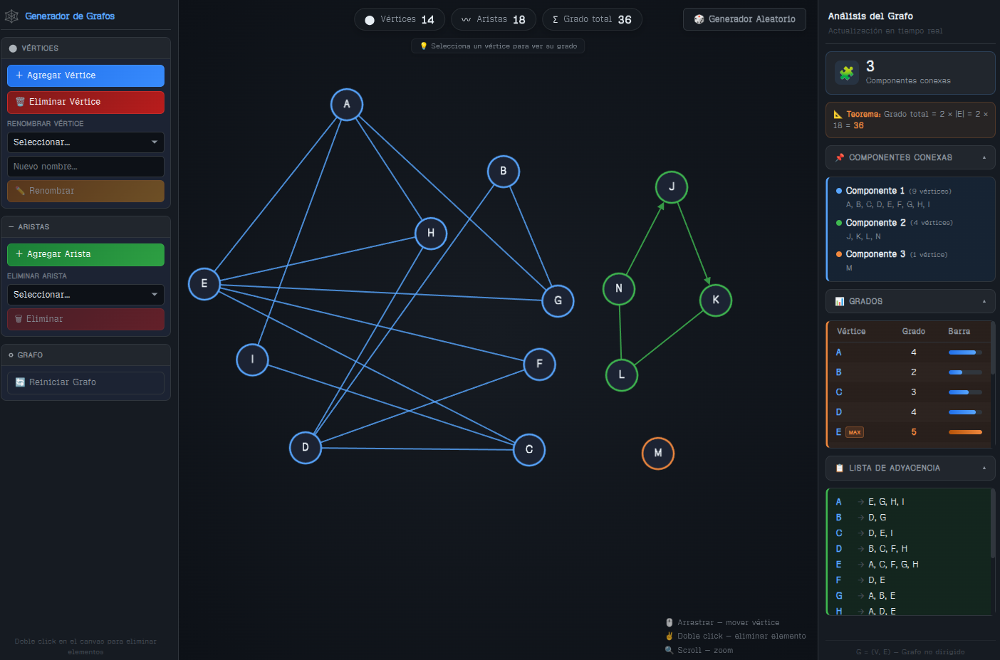

# 🕸️ Grafos Web — Generador y Analizador de Grafos Interactivos

Una plataforma web interactiva y visual diseñada para la creación, exploración y análisis matemático de estructuras de grafos en tiempo real.

  

---

## 🌐 Enlace del Proyecto

Puedes acceder a la versión desplegada y lista para usar de la aplicación aquí:
👉 **[Graph Generator (Producción)](https://grafosgenerator.vercel.app/)**

---

## 📈 Características del Analizador

La aplicación combina el modelado visual dinámico con algoritmos de la teoría de grafos para ofrecer un análisis detallado e instantáneo:

### 🧩 1. Análisis Algorítmico

- **Componentes Conexas**: Un algoritmo de recorrido en tiempo real agrupa y pinta automáticamente los nodos del grafo pertenecientes a la misma componente conexa con colores distintivos.
- **Lista de Adyacencia**: Conversión en tiempo real de la estructura visual a una representación en forma de lista de adyacencia de texto, mostrando claramente los vecinos directos de cada nodo.

### 📐 2. Métricas y Teoría de Grafos

- **Teorema del Apretón de Manos**: Demostración y validación matemática en vivo de la fórmula fundamental de la teoría de grafos: $\sum_{v \in V} \text{deg}(v) = 2 \times |E|$.
- **Tabla de Grados**: Panel dinámico que detalla el grado exacto de cada vértice. El sistema identifica automáticamente e introduce etiquetas de alerta para el vértice de grado máximo (**MAX**) y el de grado mínimo (**MIN**).

### ⚙️ 3. Herramientas de Modelado e Interacción

- **Interacción Híbrida**: Crea vértices haciendo clic directo en el lienzo, arrastra nodos para reubicar su posición y conéctalos fácilmente seleccionando un origen y un destino.
- **Control del Flujo de Creación**: Ventana modal interactiva para seleccionar si una nueva arista debe ser dirigida (con flecha indicadora) o no dirigida, con opción de recordar la selección.
- **Cancelación con un Botón**: Todos los flujos activos (modo agregar vértice, agregar arista o modo eliminar) pueden ser cancelados al instante presionando la tecla `Esc`.
- **Generador Aleatorio**: Generación paramétrica instantánea de grafos aleatorios especificando la cantidad deseada de nodos y enlaces para realizar simulaciones rápidas.
